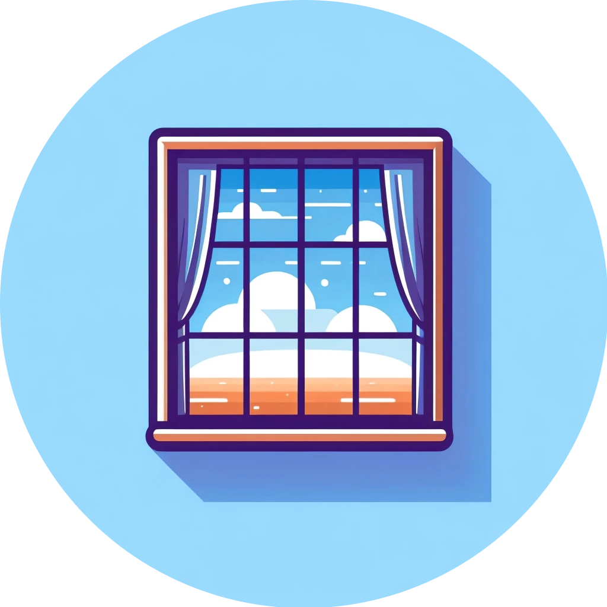

[![Forks][forks-shield]][forks-url]
[![Stargazers][stars-shield]][stars-url]
[![Issues][issues-shield]][issues-url]
[![MIT License][license-shield]][license-url]

<br />
<div align="center">
  <a href="https://github.com/dan-online/window">
    
  </a>

<h3 align="center">window</h3>
  <p align="center">
    effortlessly watch videos directly in your terminal</br> with support for local, remote or YouTube videos
    <br />
    <br />
    <a href="https://github.com/dan-online/window/issues">Report Bug</a>
    ·
    <a href="https://github.com/dan-online/window/issues">Request Feature</a>
  </p>
</div>

## About The Project

Window is a terminal-based video player that allows you to watch videos directly in your terminal. It supports local, remote, and YouTube videos assisted by hardware acceleration.

### Features

- Variety of video sources
    - Local file
    - Remote file
    - YouTube video
      - VOD
      - Live
    - Live Stream
- Hardware acceleration
    - Utilizes hardware acceleration for decoding video streams

## TODO

- [ ] Error handling
  - Currently I just propagate errors with anyhow and sometimes with context or at least a good error message
- [ ] Full screen mode
- [ ] Tests
- [ ] Audio???
- [ ] Subtitles???
- [ ] More accurate text rendering

## Getting Started

### Docker cli

```bash
$ docker run -it --rm danonline/window:latest --help
$ docker run -it --rm danonline/window:latest https://www.youtube.com/watch?v=dQw4w9WgXcQ
```

### Bin

Check out the [releases](https://github.com/dan-online/window/releases) page for the latest binaries.

## License

Distributed under the MIT License. See [`LICENSE`](https://dancodes.mit-license.org) for more information.

## Contact

DanCodes - <dan@dancodes.online>

Project Link: [https://github.com/dan-online/window](https://github.com/dan-online/window)

## Disclaimer

The information and software contained herein are provided solely for educational purposes. I am not responsible for any misuse of this software for copyright infringement.

<!-- MARKDOWN LINKS & IMAGES -->
<!-- https://www.markdownguide.org/basic-syntax/#reference-style-links -->
[contributors-shield]: https://img.shields.io/github/contributors/dan-online/window.svg?style=for-the-badge
[contributors-url]: https://github.com/dan-online/window/graphs/contributors
[forks-shield]: https://img.shields.io/github/forks/dan-online/window.svg?style=for-the-badge
[forks-url]: https://github.com/dan-online/window/network/members
[stars-shield]: https://img.shields.io/github/stars/dan-online/window.svg?style=for-the-badge
[stars-url]: https://github.com/dan-online/window/stargazers
[issues-shield]: https://img.shields.io/github/issues/dan-online/window.svg?style=for-the-badge
[issues-url]: https://github.com/dan-online/window/issues
[license-shield]: https://img.shields.io/github/license/dan-online/window.svg?style=for-the-badge
[license-url]: https://github.com/dan-online/window/blob/master/LICENSE.txt
